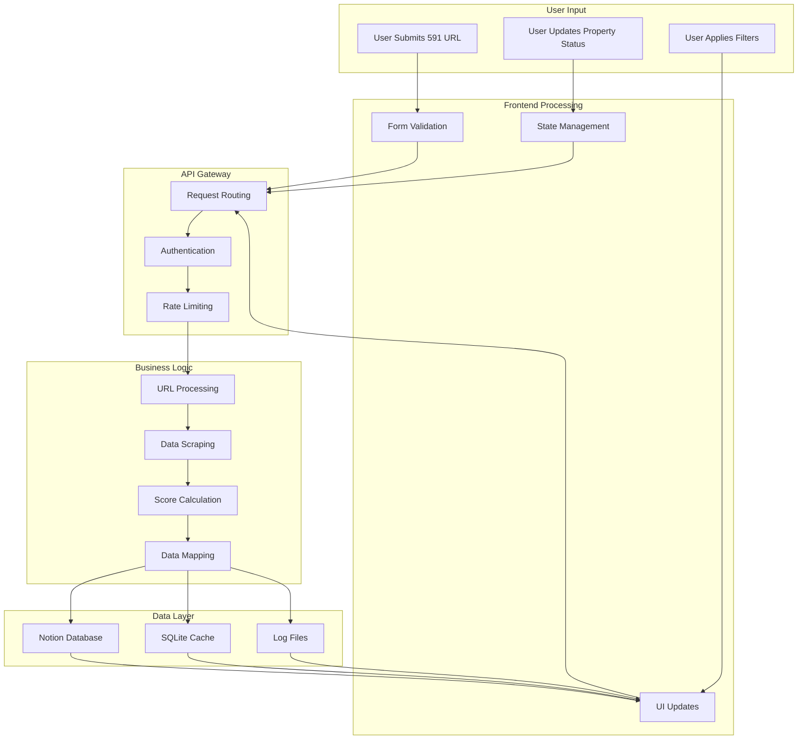
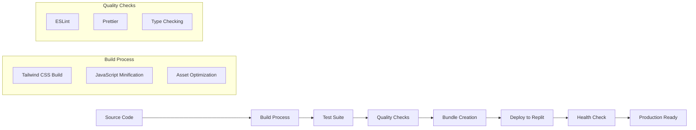

# 房源 CRM 系統 - App Blueprint 架構藍圖
https://github.com/chr1st1anw0w/rental-crm-system
## 📐 系統架構藍圖

### 🎯 核心設計原則

- **手機優先 (Mobile First)**: 所有元件都針對手機螢幕優化
- **開源 SVG 圖示**: 使用 Lucide 圖示庫，杜絕表情符號
- **響應式設計**: 支援各種裝置尺寸
- **MCP 標準**: 遵循 Model Context Protocol 標準
- **模組化架構**: 每個元件都可獨立開發與測試

## 🏗️ 前端架構藍圖

### 📱 主要組件結構

```
┌─────────────────────────────────────────────────────────────────┐
│                    Mobile Web Application                       │
├─────────────────────────────────────────────────────────────────┤
│  ┌─────────────────┐ ┌─────────────────┐ ┌─────────────────┐    │
│  │   Navigation    │ │   Main Content  │ │   Sidebar Menu  │    │
│  │   Component     │ │   Container     │ │   Component     │    │
│  └─────────────────┘ └─────────────────┘ └─────────────────┘    │
│  ┌─────────────────┐ ┌─────────────────┐ ┌─────────────────┐    │
│  │   Property      │ │   Add Property  │ │   Statistics    │    │
│  │   Cards         │ │   Form          │ │   Dashboard     │    │
│  └─────────────────┘ └─────────────────┘ └─────────────────┘    │
│  ┌─────────────────┐ ┌─────────────────┐ ┌─────────────────┐    │
│  │   Filter Bar    │ │   Progress      │ │   Notification  │    │
│  │   Component     │ │   Component     │ │   Component     │    │
│  └─────────────────┘ └─────────────────┘ └─────────────────┘    │
└─────────────────────────────────────────────────────────────────┘
```

### 🎨 UI 元件庫

#### 1. 導航元件 (Navigation Components)
```
TopNavigation
├── Logo/Title
├── Menu Toggle Button (Hamburger)
├── Search Icon
├── Add Property Button
└── User Profile Icon

SidebarNavigation
├── Header Section
│   ├── Logo + Title
│   └── Close Button
├── Main Functions
│   ├── Property List
│   ├── Add Property
│   └── Statistics
├── Filter Functions
│   ├── High Score Properties
│   ├── Pet Friendly
│   └── Near MRT
└── Settings Section
    ├── System Settings
    ├── Help Guide
    └── About
```

#### 2. 內容元件 (Content Components)
```
PropertyCard
├── Property Image (左側)
├── Property Info (右側)
│   ├── Price (大字體)
│   ├── Address (小字體)
│   └── Room Type + Area
├── Score & Status
│   ├── Score Badge
│   └── Status Badge
├── Feature Tags
│   ├── Pet Friendly
│   ├── Air Conditioning
│   └── Near MRT
└── Action Buttons
    ├── View Details
    ├── Contact Owner
    └── More Options

AddPropertyForm
├── URL Input Field
├── Processing Options
│   ├── Auto Score Checkbox
│   └── Dry Run Checkbox
├── Progress Indicator
└── Action Buttons
    ├── Start Processing
    └── Cancel

StatisticsCard
├── Icon (左側)
├── Metric Info (右側)
│   ├── Main Number
│   ├── Description
│   └── Trend Indicator
└── Status Color
```

#### 3. 互動元件 (Interactive Components)
```
FilterBar
├── Search Input
├── Filter Dropdown
├── Sort Dropdown
└── Clear Filters Button

ProgressIndicator
├── Progress Bar
├── Current Status Text
├── Percentage
└── Cancel Button

NotificationToast
├── Icon (Success/Error/Warning)
├── Message Text
├── Action Button (Optional)
└── Auto-dismiss Timer
```

## 🔧 後端架構藍圖

### 🌐 API 服務結構

```
┌─────────────────────────────────────────────────────────────────┐
│                      Express.js Server                         │
├─────────────────────────────────────────────────────────────────┤
│  ┌─────────────────┐ ┌─────────────────┐ ┌─────────────────┐    │
│  │   API Router    │ │   Middleware    │ │   MCP Service   │    │
│  │   Layer         │ │   Layer         │ │   Layer         │    │
│  └─────────────────┘ └─────────────────┘ └─────────────────┘    │
│  ┌─────────────────┐ ┌─────────────────┐ ┌─────────────────┐    │
│  │   Property      │ │   Authentication│ │   Intelligent   │    │
│  │   Routes        │ │   Middleware    │ │   Mapper        │    │
│  └─────────────────┘ └─────────────────┘ └─────────────────┘    │
│  ┌─────────────────┐ ┌─────────────────┐ ┌─────────────────┐    │
│  │   SSE Stream    │ │   Error Handler │ │   Intelligent   │    │
│  │   Handler       │ │   Middleware    │ │   Scorer        │    │
│  └─────────────────┘ └─────────────────┘ └─────────────────┘    │
└─────────────────────────────────────────────────────────────────┘
```

### 🔗 服務層架構

```
Service Layer
├── NotionService
│   ├── Database Connection
│   ├── CRUD Operations
│   ├── Field Mapping
│   └── Error Handling
├── ScraperService
│   ├── 591 Website Scraper
│   ├── Anti-Detection
│   ├── Data Extraction
│   └── Rate Limiting
├── ScoringService
│   ├── Intelligent Scoring
│   ├── Rule Engine
│   ├── Preference Matching
│   └── Score Calculation
└── MappingService
    ├── Data Transformation
    ├── Field Validation
    ├── Schema Conversion
    └── Error Recovery
```

## 📊 資料流架構

### 🔄 資料處理流程



## 🎯 狀態管理藍圖

### 📦 Alpine.js 狀態結構

```javascript
// 全域狀態管理
Alpine.store('app', {
    // UI 狀態
    ui: {
        showSidebar: false,
        showAddForm: false,
        loading: false,
        currentView: 'properties'
    },
    
    // 資料狀態
    data: {
        properties: [],
        filteredProperties: [],
        stats: {
            total: 0,
            highScore: 0,
            pending: 0,
            viewed: 0
        }
    },
    
    // 篩選狀態
    filters: {
        search: '',
        status: 'all',
        minScore: 0,
        maxScore: 100,
        sortBy: 'score',
        sortOrder: 'desc'
    },
    
    // 處理狀態
    processing: {
        active: false,
        progress: 0,
        total: 0,
        current: '',
        results: []
    }
});
```

### 🔧 狀態更新模式

```javascript
// 狀態更新函數
const stateUpdaters = {
    // 更新 UI 狀態
    toggleSidebar() {
        this.$store.app.ui.showSidebar = !this.$store.app.ui.showSidebar;
    },
    
    // 更新資料狀態
    updateProperties(properties) {
        this.$store.app.data.properties = properties;
        this.updateStats();
        this.applyFilters();
    },
    
    // 更新篩選狀態
    applyFilters() {
        const { properties } = this.$store.app.data;
        const { filters } = this.$store.app;
        
        let filtered = properties;
        
        // 應用篩選邏輯
        if (filters.search) {
            filtered = filtered.filter(p => 
                p.title.toLowerCase().includes(filters.search.toLowerCase())
            );
        }
        
        if (filters.status !== 'all') {
            filtered = filtered.filter(p => p.status === filters.status);
        }
        
        // 應用評分範圍
        filtered = filtered.filter(p => 
            p.score >= filters.minScore && p.score <= filters.maxScore
        );
        
        // 應用排序
        filtered.sort((a, b) => {
            const order = filters.sortOrder === 'desc' ? -1 : 1;
            return order * (a[filters.sortBy] - b[filters.sortBy]);
        });
        
        this.$store.app.data.filteredProperties = filtered;
    },
    
    // 更新處理狀態
    updateProcessing(status) {
        Object.assign(this.$store.app.processing, status);
    }
};
```

## 📱 響應式設計藍圖

### 🔍 斷點策略

```css
/* 響應式斷點設計 */
:root {
    --breakpoint-xs: 320px;  /* 小手機 */
    --breakpoint-sm: 640px;  /* 大手機 */
    --breakpoint-md: 768px;  /* 平板 */
    --breakpoint-lg: 1024px; /* 桌面 */
    --breakpoint-xl: 1280px; /* 大桌面 */
}

/* 手機優先設計 */
.container {
    /* 基礎手機樣式 */
    padding: 1rem;
    max-width: 100%;
}

/* 大手機 */
@media (min-width: 640px) {
    .container {
        padding: 1.5rem;
    }
    
    .property-grid {
        grid-template-columns: repeat(2, 1fr);
    }
}

/* 平板 */
@media (min-width: 768px) {
    .container {
        padding: 2rem;
    }
    
    .property-grid {
        grid-template-columns: repeat(3, 1fr);
    }
    
    .sidebar {
        position: static;
        transform: translateX(0);
    }
}

/* 桌面 */
@media (min-width: 1024px) {
    .container {
        max-width: 1200px;
        margin: 0 auto;
    }
    
    .property-grid {
        grid-template-columns: repeat(4, 1fr);
    }
}
```

### 🎨 設計系統

```css
/* 設計系統變數 */
:root {
    /* 顏色系統 */
    --color-primary: #3b82f6;
    --color-secondary: #64748b;
    --color-success: #10b981;
    --color-warning: #f59e0b;
    --color-error: #ef4444;
    --color-info: #06b6d4;
    
    /* 文字大小 */
    --text-xs: 0.75rem;
    --text-sm: 0.875rem;
    --text-base: 1rem;
    --text-lg: 1.125rem;
    --text-xl: 1.25rem;
    --text-2xl: 1.5rem;
    --text-3xl: 1.875rem;
    
    /* 間距系統 */
    --space-1: 0.25rem;
    --space-2: 0.5rem;
    --space-3: 0.75rem;
    --space-4: 1rem;
    --space-5: 1.25rem;
    --space-6: 1.5rem;
    --space-8: 2rem;
    
    /* 陰影系統 */
    --shadow-sm: 0 1px 2px 0 rgba(0, 0, 0, 0.05);
    --shadow-md: 0 4px 6px -1px rgba(0, 0, 0, 0.1);
    --shadow-lg: 0 10px 15px -3px rgba(0, 0, 0, 0.1);
    
    /* 圓角系統 */
    --radius-sm: 0.125rem;
    --radius-md: 0.375rem;
    --radius-lg: 0.5rem;
    --radius-xl: 0.75rem;
}
```

## 🔧 元件開發藍圖

### 🎯 元件開發原則

1. **單一職責**: 每個元件只負責一個功能
2. **可重用性**: 元件應該可以在不同場景中重用
3. **可測試性**: 元件應該易於測試
4. **可訪問性**: 符合 WCAG 2.1 AA 標準
5. **手機優先**: 所有元件都先針對手機設計

### 📦 元件開發模板

```javascript
// 元件開發模板
const ComponentTemplate = {
    // 元件名稱
    name: 'ComponentName',
    
    // 元件資料
    data() {
        return {
            // 元件狀態
            state: 'idle',
            // 元件資料
            data: null,
            // 元件配置
            config: {}
        };
    },
    
    // 元件方法
    methods: {
        // 初始化
        init() {
            this.setupEventListeners();
            this.loadData();
        },
        
        // 設定事件監聽器
        setupEventListeners() {
            // 事件監聽邏輯
        },
        
        // 載入資料
        async loadData() {
            try {
                this.state = 'loading';
                // 載入資料邏輯
                this.state = 'loaded';
            } catch (error) {
                this.state = 'error';
                console.error('Component error:', error);
            }
        },
        
        // 清理資源
        cleanup() {
            // 清理邏輯
        }
    },
    
    // 生命週期
    mounted() {
        this.init();
    },
    
    beforeUnmount() {
        this.cleanup();
    }
};
```

## 🚀 部署架構藍圖

### 🌐 部署策略

```
部署環境
├── Development
│   ├── Local Development Server
│   ├── Hot Module Replacement
│   ├── Debug Mode
│   └── Mock Data
├── Staging
│   ├── Replit Preview
│   ├── Feature Testing
│   ├── Integration Testing
│   └── Performance Testing
└── Production
    ├── Replit Deployment
    ├── Custom Domain
    ├── SSL Certificate
    └── Monitoring
```

### 🔧 建置流程



## 📈 效能最佳化藍圖

### ⚡ 效能指標

```javascript
// 效能監控指標
const PerformanceMetrics = {
    // 載入時間
    loadTime: {
        target: '< 2 seconds',
        measure: 'Time to Interactive'
    },
    
    // 首次內容繪製
    fcp: {
        target: '< 1.5 seconds',
        measure: 'First Contentful Paint'
    },
    
    // 累積佈局偏移
    cls: {
        target: '< 0.1',
        measure: 'Cumulative Layout Shift'
    },
    
    // 輸入延遲
    fid: {
        target: '< 100ms',
        measure: 'First Input Delay'
    },
    
    // 記憶體使用
    memory: {
        target: '< 50MB',
        measure: 'JavaScript Heap Size'
    }
};
```

### 🔧 最佳化策略

```javascript
// 最佳化策略實現
const OptimizationStrategies = {
    // 代碼分割
    codeSplitting: {
        routes: 'Dynamic imports for routes',
        components: 'Lazy loading for components',
        libraries: 'Separate vendor bundles'
    },
    
    // 資源最佳化
    assetOptimization: {
        images: 'WebP format with fallbacks',
        fonts: 'Subset and preload',
        css: 'Critical CSS inlining'
    },
    
    // 快取策略
    caching: {
        api: 'Response caching',
        assets: 'Long-term caching',
        data: 'Local storage caching'
    },
    
    // 載入最佳化
    loadOptimization: {
        preload: 'Critical resources',
        prefetch: 'Next page resources',
        lazy: 'Below-fold content'
    }
};
```

## 🔒 安全性架構

### 🛡️ 安全層級

```
安全防護層
├── 前端安全
│   ├── Content Security Policy
│   ├── XSS Protection
│   ├── Input Validation
│   └── HTTPS Enforcement
├── API 安全
│   ├── Rate Limiting
│   ├── Authentication
│   ├── Authorization
│   └── Data Validation
└── 資料安全
    ├── Encryption at Rest
    ├── Encryption in Transit
    ├── Access Control
    └── Audit Logging
```

---

## 📝 開發檢查清單

### ✅ 前端開發
- [ ] 手機優先設計完成
- [ ] 所有 SVG 圖示替換完成
- [ ] 響應式設計測試通過
- [ ] 可訪問性測試通過
- [ ] 效能指標達標

### ✅ 後端開發
- [ ] MCP 服務整合完成
- [ ] API 端點實現完成
- [ ] 錯誤處理完善
- [ ] 日誌系統完整
- [ ] 資料驗證完成

### ✅ 整合測試
- [ ] 前後端整合完成
- [ ] 實時功能測試通過
- [ ] 批量處理測試通過
- [ ] 錯誤恢復測試通過
- [ ] 效能測試通過

### ✅ 部署準備
- [ ] 環境變數設定完成
- [ ] 建置流程測試通過
- [ ] 部署腳本準備完成
- [ ] 監控系統設定完成
- [ ] 備份策略制定完成

---

<div align="center">
  <p><strong>App Blueprint v2.0.0</strong></p>
  <p>手機優先 • 開源圖示 • MCP 標準 • 一日完成</p>
  <p><em>由 Augment Agent 設計</em></p>
</div>