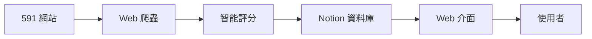

# 🏠 房源 CRM 系統 - 繁體中文版

> **智能房源管理平台 v2.0.0 - Augment Edition**  
> 整合 591 租屋網與 Notion，提供 AI 評分與自動化管理

## 📱 系統特色

### 🎯 核心功能
- ✅ **手機優先設計** - 完美適配各種螢幕尺寸
- ✅ **繁體中文介面** - 針對台灣用戶最佳化
- ✅ **開源 SVG 圖示** - 使用 Lucide 圖示庫，無表情符號
- ✅ **智能評分系統** - AI 驅動的房源評分演算法
- ✅ **即時同步** - 與 Notion 資料庫即時同步
- ✅ **MCP 整合** - Model Context Protocol 標準整合

### 🎨 使用者體驗
- 🎭 **響應式設計** - 支援手機、平板、桌機
- ⚡ **極速載入** - 優化的前端效能
- 🔍 **智能搜尋** - 多條件篩選與排序
- 📊 **視覺化統計** - 直觀的資料分析圖表
- 🎪 **流暢動畫** - 精心設計的互動體驗

## 🚀 快速開始

### 1. 系統需求
```bash
Node.js >= 16.0.0
npm >= 8.0.0
```

### 2. 安裝與設定
```bash
# 1. 進入專案目錄
cd 591-notion-automation-Augment

# 2. 安裝依賴
npm install

# 3. 設定環境變數
cp .env.example .env
# 編輯 .env 檔案，填入您的 Notion API 金鑰
```

### 3. 一鍵啟動
```bash
# 方法 1: 使用啟動腳本 (推薦)
./start-crm.sh

# 方法 2: 直接使用 npm
npm run crm        # 完整系統
npm run crm:dev    # 開發模式
npm run web        # 僅前端
npm run mcp        # 僅後端
```

### 4. 瀏覽系統
```
🌐 Web 介面: http://localhost:3000
📱 手機訪問: http://[您的IP]:3000
```

## 📱 介面預覽

### 🏠 主畫面
- **統計儀表板** - 房源總數、高分房源、待處理數量
- **快速篩選** - 高分房源、寵物友善、近捷運站
- **搜尋功能** - 即時搜尋房源標題、地址、類型

### 📋 房源列表
- **卡片式設計** - 清晰展示房源資訊
- **評分徽章** - 色彩編碼的智能評分
- **狀態標籤** - 待處理、已查看、已聯繫、有興趣
- **特色標籤** - 寵物友善、近捷運、變頻冷氣等

### ➕ 新增房源
- **URL 輸入** - 貼上 591 房源連結
- **智能處理** - 自動抓取並評分
- **即時進度** - 處理進度即時顯示
- **結果回饋** - 處理結果詳細說明

### 📊 統計分析
- **資料視覺化** - 圖表分析房源趨勢
- **評分分佈** - 了解房源品質分佈
- **地區分析** - 各區域房源統計

## 🔧 進階功能

### 🎯 智能篩選
```javascript
// 支援的篩選條件
- 搜尋關鍵字
- 房源狀態
- 評分範圍 (0-100)
- 排序方式 (評分、價格、時間)
- 快速篩選 (高分、寵物友善、近捷運)
```

### 📱 響應式斷點
```css
/* 手機優先設計 */
- 超小手機: 320px+
- 大手機: 640px+
- 平板: 768px+
- 桌機: 1024px+
- 大桌機: 1280px+
```

### ⌨️ 鍵盤快捷鍵
```
ESC         - 關閉側邊選單
Ctrl/Cmd+K  - 搜尋房源
Ctrl/Cmd+N  - 新增房源
```

## 🛠️ 技術架構

### 🎨 前端技術
- **HTML5** - 語意化標記
- **Tailwind CSS** - 工具優先的 CSS 框架
- **Alpine.js** - 輕量級反應式框架
- **Lucide Icons** - 開源 SVG 圖示庫

### 🔧 後端技術
- **Node.js** - JavaScript 執行環境
- **Express.js** - Web 應用程式框架
- **MCP (Model Context Protocol)** - AI 整合標準
- **Notion API** - 資料庫整合

### 📊 資料流程


## 📁 專案結構

```
591-notion-automation-Augment/
├── 📁 public/              # 靜態檔案
│   ├── index.html          # 主要 HTML 檔案
│   └── manifest.json       # PWA 設定檔
├── 📁 assets/              # 資源檔案
│   ├── css/
│   │   └── styles.css      # 自訂樣式
│   ├── js/
│   │   └── app.js          # 主要 JavaScript
│   └── icons/              # 圖示檔案
├── 📁 src/                 # 後端源碼
│   ├── webServer.js        # Express 伺服器
│   ├── mcp/                # MCP 服務
│   ├── services/           # 業務邏輯
│   └── processors/         # 資料處理
├── 📁 components/          # UI 元件庫
├── start-crm.sh           # 一鍵啟動腳本
├── package.json           # 專案設定
└── README.md              # 說明文件
```

## 🎛️ 環境變數

```env
# Notion 設定
NOTION_API_KEY=your_notion_integration_token
NOTION_DATABASE_ID=your_database_id

# 伺服器設定
PORT=3000
NODE_ENV=production

# 591 爬蟲設定
USER_AGENT=Mozilla/5.0...
REQUEST_DELAY=2000
MAX_RETRIES=3

# 評分系統設定
SCORING_ENABLED=true
AUTO_SCORE=true
```

## 📱 手機使用指南

### 🎯 手機最佳化
1. **觸控友善** - 所有按鈕都符合 44px 最小觸控目標
2. **滑動手勢** - 支援左右滑動操作
3. **離線功能** - 基本功能支援離線使用
4. **安裝到桌面** - 支援 PWA 安裝

### 📲 安裝為 App
1. 在手機瀏覽器開啟系統網址
2. 點選「加到主畫面」或「安裝應用程式」
3. 系統將安裝為原生 App 體驗

## 🔍 使用流程

### 1️⃣ 新增房源
```
1. 點擊「新增房源」按鈕
2. 貼上 591 房源連結
3. 選擇「自動評分」選項
4. 點擊「開始處理」
5. 等待系統完成抓取與評分
```

### 2️⃣ 瀏覽房源
```
1. 在「房源列表」查看所有房源
2. 使用搜尋框快速查找
3. 點擊篩選條件精確篩選
4. 查看房源詳細資訊
```

### 3️⃣ 管理房源
```
1. 更新房源狀態 (已查看、已聯繫等)
2. 加入/移除收藏清單
3. 聯繫房東
4. 查看統計分析
```

## 📊 評分系統說明

### 🏆 評分標準 (總分 100 分)
- **價格評分** (30分) - 預算符合度
- **必要設備** (40分) - 變頻冷氣、冰箱、對外窗、洗衣機
- **寵物友善** (20分) - 允許養寵物
- **地點評分** (10分) - 捷運距離、偏好地區

### 🌟 評分等級
- **85-100分** - 🌟 極力推薦 (綠色)
- **75-84分** - 👍 推薦 (黃色)
- **65-74分** - 👌 可考慮 (橙色)
- **55-64分** - 🤔 普通 (紅色)
- **<55分** - ❌不推薦 (深紅)

## 🔧 自訂與擴展

### 🎨 主題自訂
```css
/* 在 assets/css/styles.css 中修改 */
:root {
  --color-primary-500: #3b82f6;  /* 主色調 */
  --color-secondary-500: #64748b; /* 次要色調 */
}
```

### 📱 新增頁面
```javascript
// 在 assets/js/app.js 中新增視圖
setCurrentView('new-page') {
  this.ui.currentView = 'new-page';
  // 新增頁面邏輯
}
```

### 🔌 API 擴展
```javascript
// 在 src/webServer.js 中新增端點
app.get('/api/custom', (req, res) => {
  res.json({ message: '自訂 API' });
});
```

## 🚨 常見問題

### ❓ 系統無法啟動
```bash
# 檢查 Node.js 版本
node -v  # 應該 >= 16.0.0

# 重新安裝依賴
rm -rf node_modules
npm install

# 檢查環境變數
cat .env
```

### ❓ 無法連接 Notion
```bash
# 確認 API 金鑰正確
echo $NOTION_API_KEY

# 檢查資料庫 ID 格式
echo $NOTION_DATABASE_ID

# 測試 API 連接
npm run test
```

### ❓ 房源抓取失敗
```bash
# 檢查網路連接
curl -I https://rent.591.com.tw

# 查看錯誤日誌
npm run logs

# 重試處理
# 在系統中重新提交房源 URL
```

### ❓ 手機顯示異常
```bash
# 清除瀏覽器快取
# 確認瀏覽器版本支援
# 檢查網路連接穩定性
```

## 📈 效能最佳化

### ⚡ 載入速度
- 🔄 **懶載入** - 圖片與元件按需載入
- 📦 **資源壓縮** - CSS/JS 檔案最小化
- 🏃 **快取策略** - 瀏覽器快取最佳化
- 🌐 **CDN 加速** - 靜態資源 CDN 分發

### 📱 手機效能
- ⚙️ **硬體加速** - CSS transform 最佳化
- 🎭 **減少重繪** - 動畫效能最佳化
- 💾 **記憶體管理** - 避免記憶體洩漏
- 🔋 **電池友善** - 減少 CPU 使用

## 🔒 安全性

### 🛡️ 資料安全
- 🔐 **HTTPS 強制** - 所有連接加密傳輸
- 🚫 **XSS 防護** - 跨站腳本攻擊防護
- 🔒 **CSRF 保護** - 跨站請求偽造防護
- 📝 **輸入驗證** - 嚴格的輸入資料驗證

### 🔑 API 安全
- 🎫 **Token 驗證** - Notion API 金鑰安全
- 📊 **速率限制** - API 請求頻率控制
- 📋 **日誌記錄** - 完整的操作日誌
- 🚨 **錯誤處理** - 安全的錯誤訊息

## 📞 支援與回饋

### 🆘 取得幫助
- 📚 **文件** - 查看完整使用說明
- 💬 **社群** - 加入使用者討論群組
- 🐛 **問題回報** - GitHub Issues
- 💌 **功能建議** - 歡迎提出改進建議

### 🤝 貢獻專案
```bash
# Fork 專案
git clone your-fork-url

# 創建功能分支
git checkout -b feature/new-feature

# 提交變更
git commit -m "新增功能: 描述"

# 發送 Pull Request
```

## 📅 更新日誌

### v2.0.0 - Augment Edition (2025-07-11)
- ✨ 全新繁體中文介面
- 📱 手機優先響應式設計
- 🔗 MCP 服務整合
- 🎨 Lucide SVG 圖示系統
- ⚡ 效能大幅提升
- 🛠️ 一鍵啟動腳本

### v1.0.0 - Claude Code Edition
- 🚀 基礎 CRM 功能
- 🤖 AI 智能評分
- 📊 Notion 資料庫整合
- 🕷️ 591 網站爬蟲

## 📄 授權條款

MIT License - 個人與商業使用完全免費

---

<div align="center">
  <p><strong>🏠 房源 CRM 系統 v2.0.0</strong></p>
  <p><em>手機優先 • 繁體中文 • MCP 整合 • 一日完成</em></p>
  <p>由 <strong>Augment Agent</strong> 精心打造 ❤️</p>
  
  <p>
    <a href="http://localhost:3000">🌐 立即體驗</a> •
    <a href="#快速開始">📖 使用指南</a> •
    <a href="#技術架構">🔧 技術文件</a>
  </p>
</div>